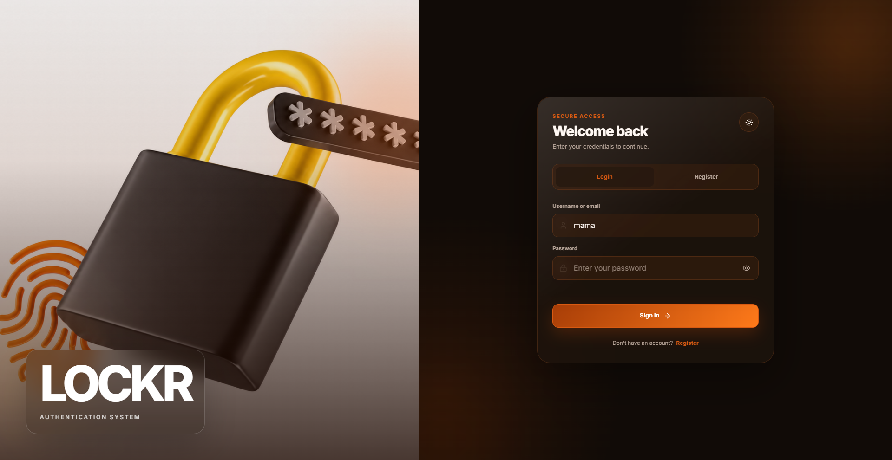
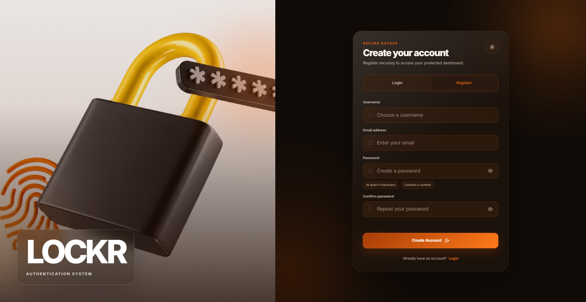
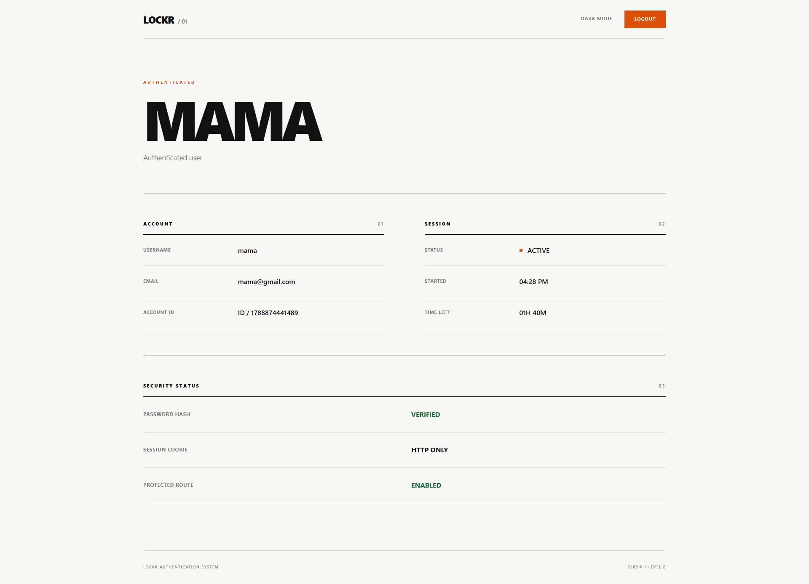
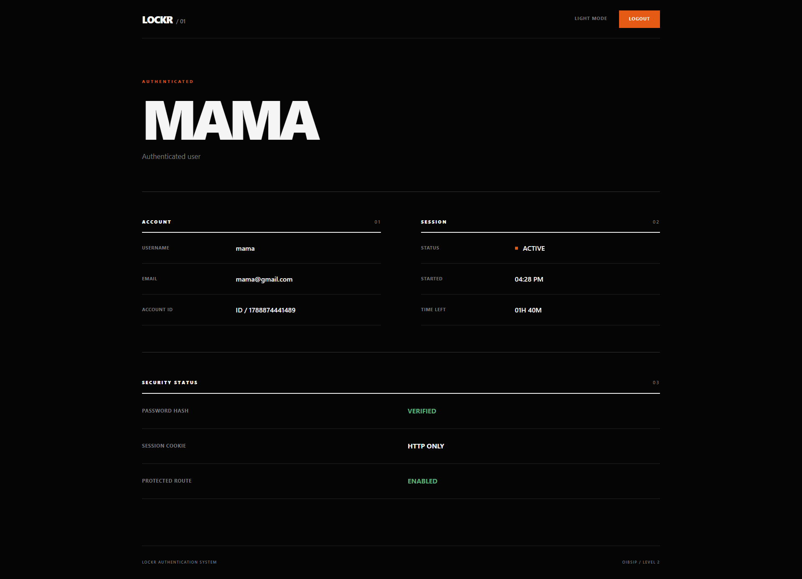

# LOCKR Authentication System

LOCKR is a secure user authentication system developed for the **Oasis Infobyte Web Development and Designing Internship — Level 2**.

The application allows users to create accounts, securely authenticate, access a protected dashboard, switch between light and dark themes, and safely terminate authenticated sessions.

---

## Overview

LOCKR demonstrates the fundamental architecture of a user authentication system using a Node.js and Express backend.

The project implements registration, password hashing, login verification, server-managed sessions, protected routes, and secure logout while maintaining a minimal responsive user interface.

---

## Features

### User Registration

Users can create an account using:

- Username
- Email address
- Password
- Password confirmation

Registration includes both client-side and server-side validation.

Usernames must:

- Be between 3 and 30 characters
- Contain only letters, numbers, and underscores

Passwords must:

- Be at least 8 characters long
- Contain at least one number
- Match the confirmation password

Duplicate usernames and email addresses are rejected.

---

### Secure Password Storage

Passwords are never stored in plain text.

LOCKR uses `bcryptjs` to hash passwords before they are stored.

The application uses bcrypt password comparison during login rather than directly comparing passwords.

---

### User Login

Users can sign in using either their:

- Username
- Email address

The supplied password is securely compared against the stored bcrypt hash.

Invalid login attempts return a generic authentication error:

```text
Invalid username, email or password.
```

This prevents the application from revealing whether a specific username or email address exists.

---

### Authenticated Sessions

LOCKR uses `express-session` to maintain authenticated user sessions.

Session configuration includes:

- HTTP-only session cookies
- SameSite cookie protection
- Secure cookies when running in production
- Two-hour session duration
- Session regeneration after successful login

The authenticated session stores only the information required to identify the signed-in user.

---

### Protected Dashboard

The `/dashboard` route is protected using server-side authentication middleware.

Users who attempt to access the dashboard without an authenticated session are redirected to the login page.

The dashboard displays:

- Username
- Email address
- Account ID
- Session status
- Login time
- Remaining session time
- Password hash status
- Session cookie status
- Protected route status

---

### Logout

Users can securely terminate their session using the **Logout** button.

Logging out:

- Destroys the active Express session
- Clears the session cookie
- Redirects the user to the authentication page
- Prevents further access to the protected dashboard

After logout, manually navigating to `/dashboard` redirects the user back to the login page.

---

### Theme Support

LOCKR includes both light and dark themes.

The selected theme is stored using browser `localStorage`.

The visual design uses a minimal interface with dark-orange accents.

Dark mode uses a near-black background for stronger contrast.

---

### Responsive Design

The authentication interface and protected dashboard are responsive and designed for:

- Desktop computers
- Tablets
- Mobile devices

---

## Technologies Used

### Frontend

- HTML5
- CSS3
- JavaScript

### Backend

- Node.js
- Express.js

### Authentication and Security

- bcryptjs
- express-session

### Data Storage

- JSON file storage

---

## Project Structure

```text
WebDev-L2-Authentication/
├── data/
│   └── users.example.json
├── protected/
│   └── dashboard.html
├── public/
│   ├── images/
│   │   └── lockr-auth-bg.jpg
│   ├── auth.js
│   ├── dashboard.css
│   ├── dashboard.js
│   ├── index.html
│   └── style.css
├── screenshots/
│   ├── lockr-login.png
│   ├── lockr-register.png
│   ├── lockr-dashboard-light.png
│   └── lockr-dashboard-dark.png
├── .gitignore
├── package.json
├── package-lock.json
├── README.md
└── server.js
```

The runtime `data/users.json` file is intentionally excluded from Git to prevent registered user information from being committed to the public repository.

LOCKR automatically creates the file when the application starts if it does not already exist.

A safe empty example file is provided as:

```text
data/users.example.json
```

---

## Installation

### 1. Clone the Repository

```bash
git clone https://github.com/HamphreyChinyerere/OIBSIP.git
```

### 2. Navigate to the Authentication Project

```bash
cd OIBSIP/WebDev-L2-Authentication
```

### 3. Install Dependencies

```bash
npm install
```

### 4. Start the Application

```bash
npm start
```

For development mode:

```bash
npm run dev
```

### 5. Open LOCKR

Open the following address in your browser:

```text
http://localhost:3000
```

---

## Application Flow

```text
Register
   ↓
Validate account information
   ↓
Hash password using bcrypt
   ↓
Store user account
   ↓
Login
   ↓
Verify username/email and password
   ↓
Create authenticated session
   ↓
Redirect to protected dashboard
   ↓
Display authenticated account information
   ↓
Logout
   ↓
Destroy session
   ↓
Return to login page
```

---

## Authentication Flow

### Registration

When a user registers, LOCKR:

1. Receives the username, email address, and password.
2. Validates the supplied information.
3. Checks for duplicate usernames.
4. Checks for duplicate email addresses.
5. Hashes the password using bcrypt.
6. Stores the account information.
7. Returns a successful account creation response.

The original password is never stored.

### Login

When a user signs in, LOCKR:

1. Accepts either a username or email address.
2. Finds the matching account.
3. Uses bcrypt to compare the supplied password with the stored password hash.
4. Regenerates the session after successful authentication.
5. Stores authenticated user information in the session.
6. Redirects the user to the protected dashboard.

### Protected Access

When `/dashboard` is requested, the server checks whether the request contains an authenticated session.

If authentication is missing, the user is redirected to:

```text
/
```

### Logout

When the user logs out, LOCKR:

1. Sends a request to the logout API.
2. Destroys the active server session.
3. Clears the LOCKR session cookie.
4. Redirects the user to the authentication page.

---

## Security Features

LOCKR demonstrates several authentication security practices:

- bcrypt password hashing
- No plain-text password storage
- Generic login error messages
- Server-side input validation
- Client-side input validation
- Duplicate username detection
- Duplicate email detection
- Protected server-side routes
- Session regeneration after login
- HTTP-only session cookies
- SameSite session cookies
- Session expiration
- Secure cookies in production
- User records excluded from Git

---

## Screenshots

### Login Page



---

### Registration Page



---

### Dashboard — Light Mode



---

### Dashboard — Dark Mode



---

## Important Data Note

The actual runtime user database:

```text
data/users.json
```

is excluded from Git using `.gitignore`.

This prevents registered usernames, email addresses, and password hashes from being accidentally committed to the public repository.

The repository instead contains:

```text
data/users.example.json
```

which provides a safe empty example of the expected storage format.

When LOCKR starts and `users.json` does not exist, the server automatically creates it.

---

## API Endpoints

### Server Health

```http
GET /api/health
```

Checks whether the LOCKR server is running.

---

### Register

```http
POST /api/register
```

Creates a new user account.

Expected information:

```json
{
  "username": "hamphrey",
  "email": "hamphrey@example.com",
  "password": "secure123"
}
```

---

### Login

```http
POST /api/login
```

Authenticates an existing account using either a username or email address.

Example:

```json
{
  "identifier": "hamphrey",
  "password": "secure123"
}
```

---

### Session

```http
GET /api/session
```

Returns information about the currently authenticated session.

The endpoint requires a valid session.

---

### Logout

```http
POST /api/logout
```

Destroys the current authenticated session.

---

## Protected Route

The main protected page is:

```text
/dashboard
```

An authenticated session is required to access this route.

Attempting to open the route while logged out redirects the user to the authentication page.

---

## Local Data Storage

Registered users are stored locally in:

```text
data/users.json
```

A stored account contains information similar to:

```json
{
  "id": "generated-user-id",
  "username": "exampleuser",
  "email": "example@example.com",
  "passwordHash": "$2b$12$...",
  "createdAt": "2026-09-08T00:00:00.000Z"
}
```

The password itself is never written to the file.

Only the bcrypt password hash is stored.

---

## Production Note

LOCKR was developed as an internship demonstration project.

The current version uses:

- JSON file storage
- Express default in-memory session storage

These are appropriate for demonstrating authentication concepts locally but are not intended as a production authentication architecture.

A production version would normally use additional infrastructure and security controls such as:

- PostgreSQL, MySQL, MongoDB, or another persistent database
- A persistent production session store
- HTTPS
- Environment-based secret management
- Rate limiting
- CSRF protection
- Security headers
- Authentication monitoring
- Structured logging
- Account recovery
- Email verification
- Multi-factor authentication

---

## Internship Task

**Oasis Infobyte Web Development and Designing Internship**

**Track:** Web Development and Designing

**Level:** Level 2

**Project:** Authentication System

---

## Repository

[View the OIBSIP Repository](https://github.com/HamphreyChinyerere/OIBSIP)

---

## Author

**Hamphrey Tanatswa Chinyerere**

GitHub: [HamphreyChinyerere](https://github.com/HamphreyChinyerere)

---

## License

This project was developed for educational and internship purposes as part of the Oasis Infobyte Internship Programme.