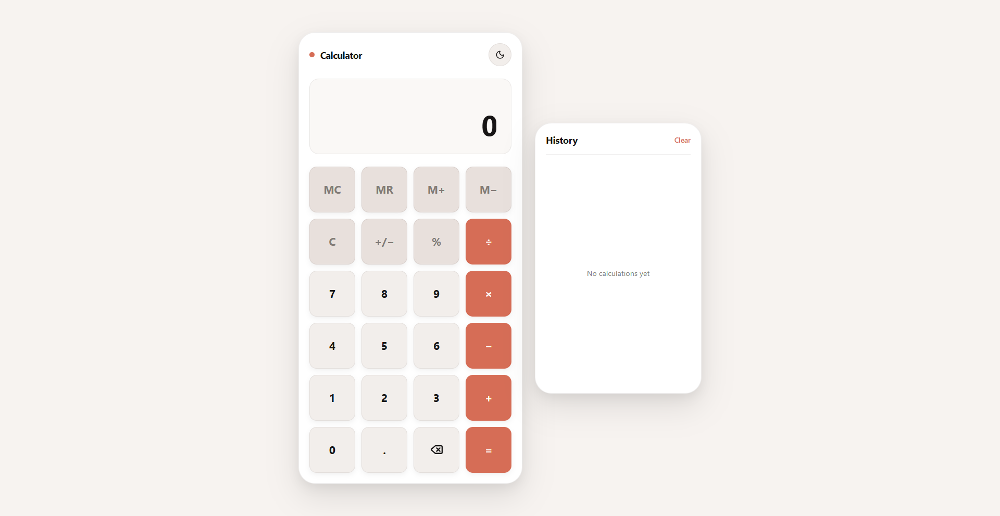
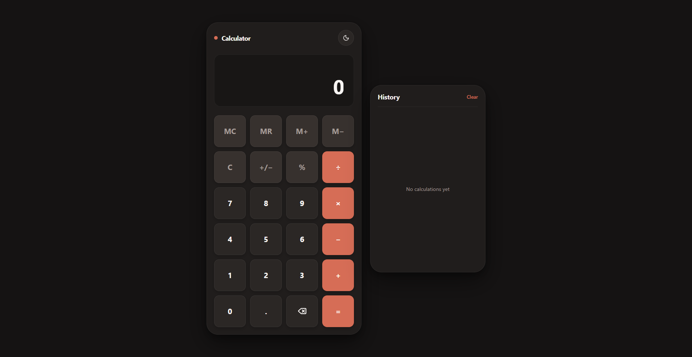
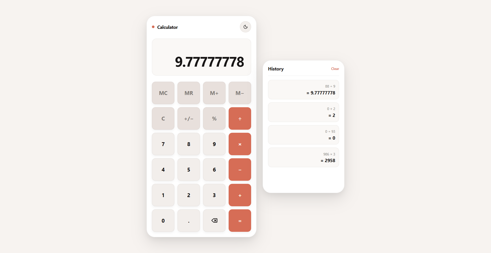

# Calculator

A modern web calculator developed for the **Oasis Infobyte Web Development and Designing Internship — Level 2**.

The application performs common arithmetic operations through a responsive calculator interface and includes additional usability features such as calculation history, memory controls, and light/dark themes.

---

## Overview

This project demonstrates the use of HTML, CSS, and JavaScript to build an interactive calculator.

The calculator processes user input directly in the browser and provides immediate results without requiring a backend.

---

## Features

### Basic Calculations

The calculator supports:

- Addition
- Subtraction
- Multiplication
- Division
- Decimal values
- Percentage calculations

---

### Calculator Controls

Users can:

- Enter numbers
- Select mathematical operators
- Clear the current calculation
- Delete individual characters
- Calculate results
- Continue calculations using previous results

---

### Calculation History

Previous calculations can be stored and displayed in the calculator history.

This allows users to review recently performed calculations without re-entering them.

---

### Memory Functions

The calculator includes memory functionality for temporarily storing numerical values during calculations.

---

### Theme Support

The interface includes:

- Light mode
- Dark mode

The theme can be switched directly from the calculator interface.

---

### Responsive Design

The calculator is responsive and designed to work across:

- Desktop computers
- Tablets
- Mobile devices

---

## Technologies Used

- HTML5
- CSS3
- JavaScript
- Lucide Icons

---

## Project Structure

```text
WebDev-L2-Calculator/
├── screenshots/
│   ├── calculator-light.png
│   ├── calculator-dark.png
│   └── calculator-history.png
├── index.html
├── style.css
├── script.js
└── README.md
```

---

## How to Run

Clone the OIBSIP repository:

```bash
git clone https://github.com/HamphreyChinyerere/OIBSIP.git
```

Navigate to the calculator project:

```bash
cd OIBSIP/WebDev-L2-Calculator
```

Open:

```text
index.html
```

in your web browser.

No package installation or backend server is required.

---

## How to Use

1. Enter numbers using the calculator keypad.
2. Select a mathematical operator.
3. Enter the next number.
4. Press the equals button to calculate the result.
5. Use the clear or delete controls when necessary.
6. Review previous calculations through the history feature.
7. Switch between light and dark themes using the theme control.

---

## Screenshots

### Calculator — Light Mode



---

### Calculator — Dark Mode



---

### Calculation History



---

## Internship Task

**Oasis Infobyte Web Development and Designing Internship**

**Track:** Web Development and Designing

**Level:** Level 2

**Project:** Calculator

---

## Repository

[View the OIBSIP Repository](https://github.com/HamphreyChinyerere/OIBSIP)

---

## Author

**Hamphrey Tanatswa Chinyerere**

GitHub: [HamphreyChinyerere](https://github.com/HamphreyChinyerere)

---

## License

This project was developed for educational and internship purposes as part of the Oasis Infobyte Internship Programme.