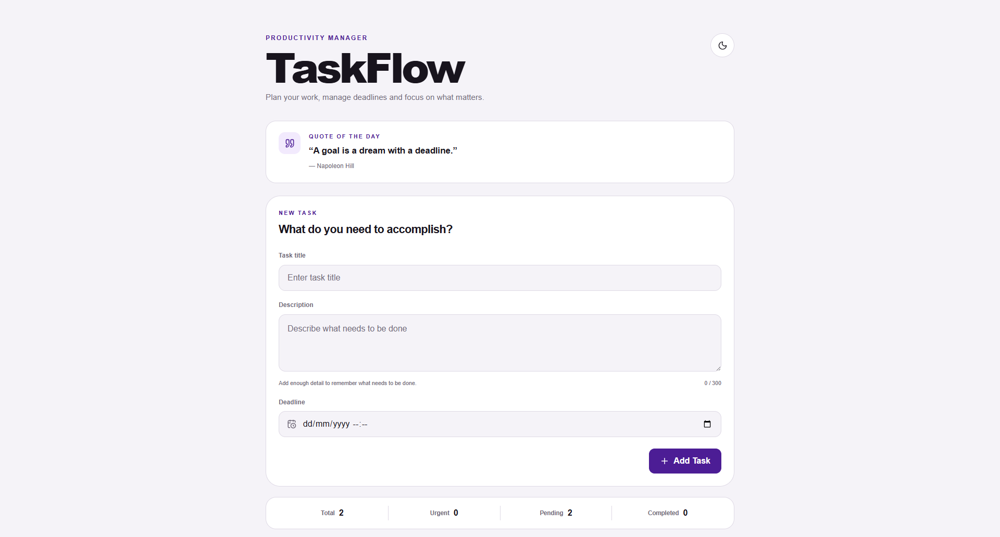
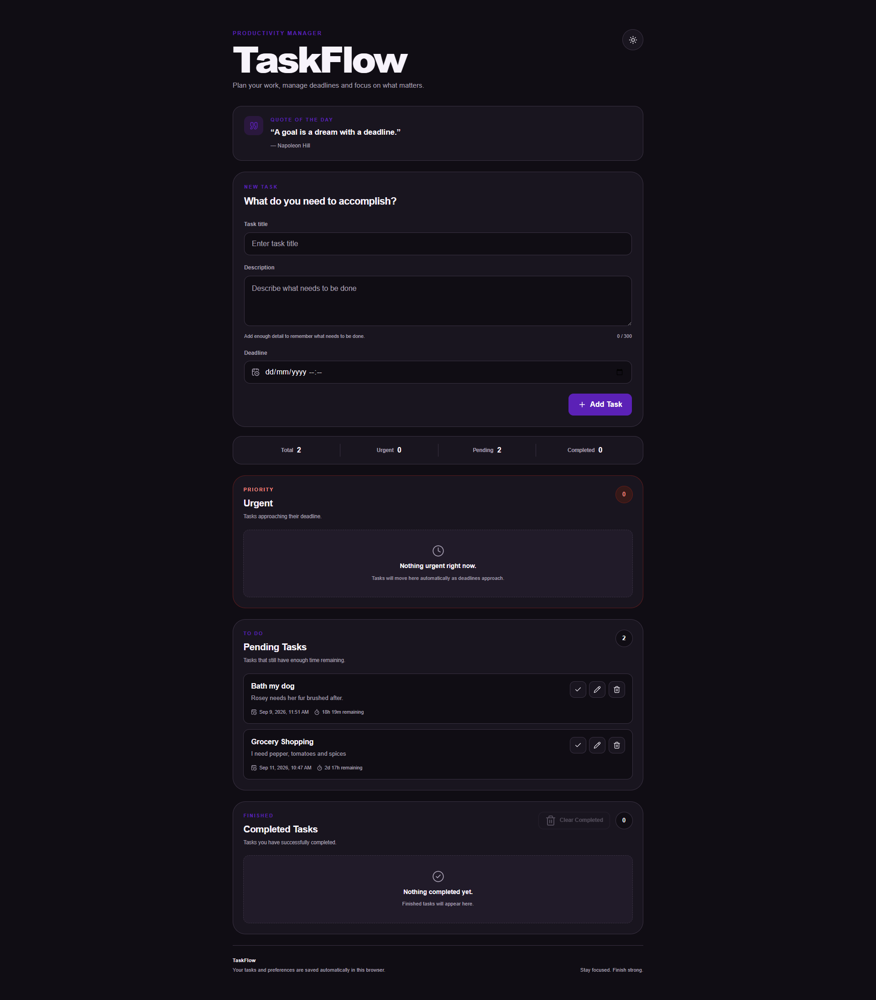

# TaskFlow To-Do Application

TaskFlow is an advanced browser-based task management application developed for the **Oasis Infobyte Web Development and Designing Internship — Level 2**.

The application allows users to create, organize, edit, complete, restore, and remove tasks while managing deadlines and automatically identifying urgent work.

---

## Overview

TaskFlow extends the traditional to-do list concept with deadline tracking, urgency detection, persistent browser storage, task descriptions, productivity quotes, and light/dark themes.

The project was built using HTML, CSS, and JavaScript without requiring a backend server.

---

## Features

### Task Creation

Users can create tasks with:

- Task title
- Task description
- Deadline date
- Deadline time

The application uses the browser's native date and time controls for deadline selection.

---

### Pending Tasks

New tasks are added to the pending task list.

Pending tasks display useful information including:

- Task title
- Description
- Deadline
- Remaining time
- Task status

Users can manage each task directly from the task list.

---

### Urgent Tasks

TaskFlow automatically identifies urgent tasks based on the amount of time remaining before their deadline.

The urgency logic works as follows:

- Tasks originally created with more than 24 hours remaining become urgent when 24 hours or less remain.
- Tasks originally created with 24 hours or less remaining become urgent when 3 hours or less remain.

Urgent tasks are moved into a dedicated section so important work is easier to identify.

---

### Automatic Expiration

Tasks whose deadlines have already passed are automatically removed from the active task list.

This prevents expired tasks from remaining indefinitely in the application.

---

### Completed Tasks

Users can mark pending tasks as completed.

Completed tasks are moved into a separate completed section.

Completed tasks can also be restored if necessary.

---

### Task Editing

Existing tasks can be edited.

Users can update:

- Task title
- Task description
- Deadline date and time

Changes are saved back into browser storage.

---

### Delete Tasks

Users can permanently delete individual tasks.

The application also includes an option to clear completed tasks.

---

### Task Statistics

TaskFlow displays task statistics so users can quickly see the current state of their task list.

Statistics include:

- Pending task count
- Completed task count

---

### Local Storage

Tasks are saved using browser `localStorage`.

This means task information remains available after:

- Refreshing the page
- Closing the browser
- Reopening the application

No backend server is required.

---

### Productivity Quotes

TaskFlow includes a collection of productivity quotes.

A quote is selected randomly when the application loads to provide additional motivation while managing tasks.

---

### Theme Support

The application supports:

- Light mode
- Dark mode

The selected theme is saved using `localStorage`.

---

### Responsive Design

TaskFlow is responsive and designed for:

- Desktop computers
- Tablets
- Mobile devices

---

## Technologies Used

- HTML5
- CSS3
- JavaScript
- Browser Local Storage
- Native date and time input controls
- Lucide Icons

---

## Project Structure

```text
WebDev-L2-TodoApp/
├── screenshots/
│   ├── todo-main.png
│   ├── todo-urgent.png
│   ├── todo-completed.png
│   └── todo-dark.png
├── index.html
├── style.css
├── script.js
└── README.md
```

---

## How to Run

Clone the OIBSIP repository:

```bash
git clone https://github.com/HamphreyChinyerere/OIBSIP.git
```

Navigate to the TaskFlow project:

```bash
cd OIBSIP/WebDev-L2-TodoApp
```

Open:

```text
index.html
```

in your web browser.

No backend server or package installation is required.

---

## How to Use

### Create a Task

1. Enter a task title.
2. Add an optional description.
3. Select a deadline date and time.
4. Add the task.

The new task will appear in the appropriate task section.

---

### Complete a Task

Select the complete action on a pending task.

The task will move from the pending section to the completed section.

---

### Restore a Task

Completed tasks can be restored to the active task list.

---

### Edit a Task

Use the edit action to modify:

- Title
- Description
- Deadline

Save the updated information to apply the changes.

---

### Delete a Task

Use the delete action to permanently remove a task.

Completed tasks can also be removed together using the clear completed option.

---

## Urgency Logic

TaskFlow determines urgency based on the amount of time the task had when it was originally created.

```text
Task originally had more than 24 hours
        ↓
24 hours or less remain
        ↓
Task becomes urgent
```

For shorter tasks:

```text
Task originally had 24 hours or less
        ↓
3 hours or less remain
        ↓
Task becomes urgent
```

This provides different warning periods for long-term and short-term tasks.

---

## Task Lifecycle

```text
Create Task
   ↓
Pending
   ↓
Deadline monitored
   ↓
Urgent when threshold is reached
   ↓
Complete Task
   ↓
Completed
```

A completed task may also be:

```text
Completed
   ↓
Restore
   ↓
Pending
```

Expired tasks are automatically removed from active tasks.

---

## Local Storage

TaskFlow uses the following browser storage keys:

```text
taskflow-tasks
taskflow-theme
```

`taskflow-tasks` stores the task list.

`taskflow-theme` stores the user's light or dark theme preference.

---

## Screenshots

### Main Task Interface



---

### Urgent Tasks


---

### Completed Tasks


---

### Dark Mode



---

## Internship Task

**Oasis Infobyte Web Development and Designing Internship**

**Track:** Web Development and Designing

**Level:** Level 2

**Project:** To-Do Web App

---

## Repository

[View the OIBSIP Repository](https://github.com/HamphreyChinyerere/OIBSIP)

---

## Author

**Hamphrey Tanatswa Chinyerere**

GitHub: [HamphreyChinyerere](https://github.com/HamphreyChinyerere)

---

## License

This project was developed for educational and internship purposes as part of the Oasis Infobyte Internship Programme.