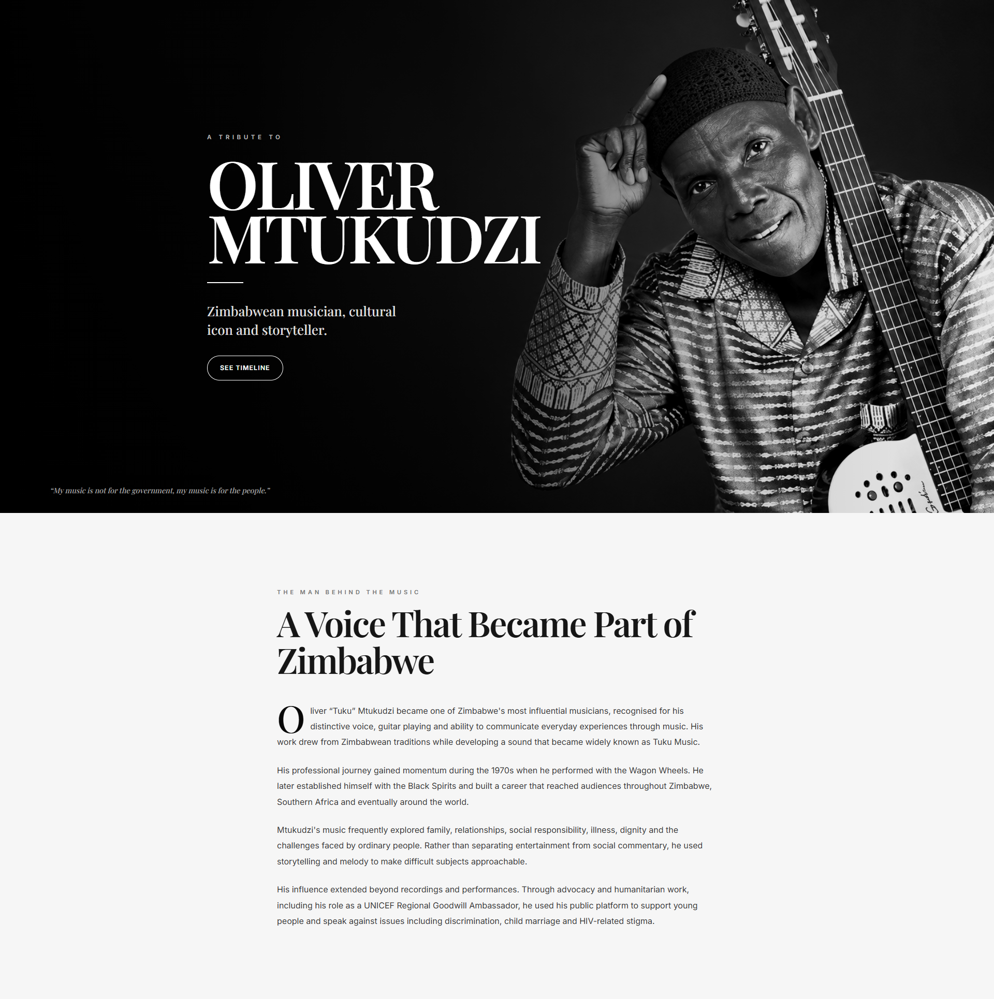
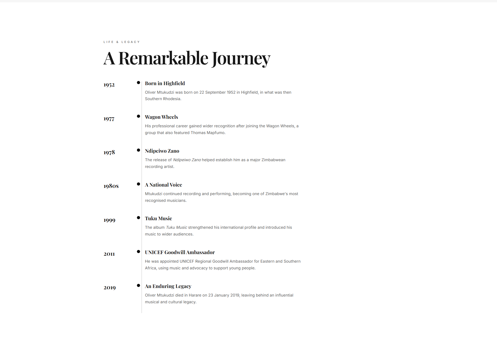
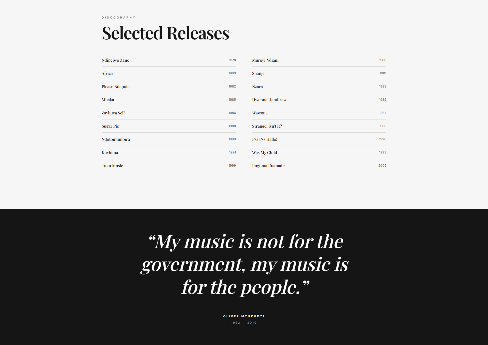

# Oliver Mtukudzi Tribute Page

A responsive tribute website dedicated to the musical legacy of Zimbabwean musician **Oliver Mtukudzi**.

This project was developed for the **Oasis Infobyte Web Development and Designing Internship — Level 2**.

---

## Overview

The project presents a visual tribute to Oliver Mtukudzi through a clean editorial-style website.

It combines photography, typography, biographical content, career milestones, and selected music releases to create a simple digital tribute experience.

The design focuses on strong visual hierarchy, large imagery, minimal styling, and responsive layouts.

---

## Features

### Hero Section

The page opens with a large visual introduction highlighting Oliver Mtukudzi.

The hero section uses:

- Large landscape imagery
- Strong typography
- Minimal supporting text
- Editorial-style composition

---

### Biography

The tribute page includes a section introducing Oliver Mtukudzi and his contribution to Zimbabwean and African music.

The content is presented in a readable layout designed to keep the focus on the artist and his legacy.

---

### Career Timeline

A chronological timeline presents important stages and milestones from his musical career.

The timeline helps organize the tribute into a clear sequence that visitors can easily follow.

---

### Selected Albums

The website includes a selected albums section showcasing releases associated with Oliver Mtukudzi's musical career.

Album information is displayed using a clean grid-based presentation.

---

### Visual Storytelling

Images are used throughout the page to support the storytelling and create a stronger visual connection to the artist.

---

### Editorial Design

The interface uses a restrained visual style inspired by editorial and music publication layouts.

The design includes:

- Black and white styling
- Large headings
- Strong spacing
- Minimal decorative elements
- Image-led sections
- Clear content hierarchy

---

### Responsive Design

The tribute page is responsive and designed to work across:

- Desktop computers
- Tablets
- Mobile devices

The layout adjusts automatically for smaller screen sizes.

---

## Technologies Used

- HTML5
- CSS3
- JavaScript

---

## Project Structure

```text
WebDev-L2-TributePage/
├── images/
├── screenshots/
│   ├── tribute-home.png
│   ├── tribute-timeline.png
│   └── tribute-albums.png
├── index.html
├── style.css
├── script.js
└── README.md
```

The exact image filenames inside the `images` directory may differ depending on the media used by the project.

---

## How to Run

Clone the OIBSIP repository:

```bash
git clone https://github.com/HamphreyChinyerere/OIBSIP.git
```

Navigate to the Tribute Page project:

```bash
cd OIBSIP/WebDev-L2-TributePage
```

Open:

```text
index.html
```

in your web browser.

No backend server or package installation is required.

---

## Page Structure

The tribute website follows a simple content flow:

```text
Hero
   ↓
Introduction
   ↓
Biography
   ↓
Career Timeline
   ↓
Selected Albums
   ↓
Legacy Content
   ↓
Footer
```

---

## Design Approach

The project uses an editorial visual direction rather than a traditional card-heavy website layout.

The main design principles include:

- Strong photography
- Large typography
- Minimal color usage
- Clear alignment
- Generous whitespace
- Simple section transitions
- Content-first presentation

The goal was to make the tribute feel closer to a digital music editorial than a conventional information page.

---

## Screenshots

### Main Tribute Page



---

### Career Timeline



---

### Selected Albums



---

## Internship Task

**Oasis Infobyte Web Development and Designing Internship**

**Track:** Web Development and Designing

**Level:** Level 2

**Project:** Tribute Page

---

## Repository

[View the OIBSIP Repository](https://github.com/HamphreyChinyerere/OIBSIP)

---

## Author

**Hamphrey Tanatswa Chinyerere**

GitHub: [HamphreyChinyerere](https://github.com/HamphreyChinyerere)

---

## License

This project was developed for educational and internship purposes as part of the Oasis Infobyte Internship Programme.